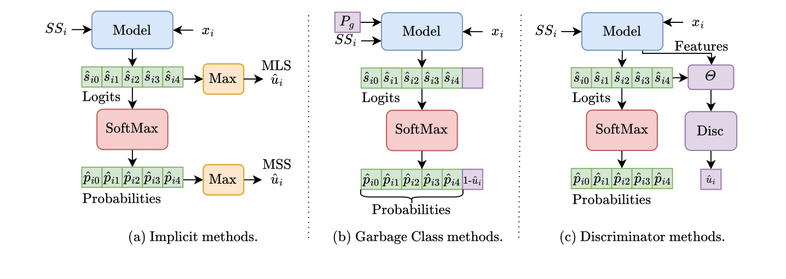

# Few-Shot Open-Set Action Recognition (FSOSAR)

<div align="center">
  
  <p><i>Overview of implicit, garbage class, and discriminator methods for few-shot open-set action recognition</i></p>
</div>

### 📊 SAFSAR Results

Combined results for SAFSAR in 5-way 1-shot and 5-shot settings:

| Dataset | OS-Method | FS ACC 1-shot | FS ACC 5-shot | OS ACC 1-shot | OS ACC 5-shot | AUROC 1-shot | AUROC 5-shot | AUPR 1-shot | AUPR 5-shot | OSCR 1-shot | OSCR 5-shot |
|---------|-----------|---------------|---------------|---------------|---------------|--------------|--------------|-------------|-------------|-------------|-------------|
| **Diving48** | Softmax | 63.49 | 74.12 | 64.16 | 65.36 | 68.48 | 71.49 | 69.71 | 72.07 | 59.86 | 66.15 |
| **Diving48** | EOS | 64.43 | 72.80 | 62.91 | 64.94 | 68.64 | 74.60 | 69.71 | 75.06 | 60.36 | 67.43 |
| **Diving48** | GC | 65.01 | 76.32 | 64.89 | 69.36 | 70.18 | 75.82 | 71.38 | 76.01 | 60.63 | 69.13 |
| **Diving48** | **FR-Disc** | **68.83** | **78.58** | **66.22** | **70.29** | **71.28** | **76.55** | **72.28** | **76.32** | **63.46** | **71.04** |
| **SSv2** | Softmax | 62.11 | 74.08 | 62.29 | 69.61 | 70.39 | 77.05 | 73.02 | 78.80 | 60.72 | 69.35 |
| **SSv2** | EOS | 62.97 | 73.84 | 65.08 | 69.90 | 71.56 | 79.60 | 73.74 | 81.18 | 61.53 | 70.38 |
| **SSv2** | GC | 62.47 | 76.24 | 64.06 | 70.89 | 69.20 | 77.62 | 70.47 | 76.92 | 59.26 | 70.20 |
| **SSv2** | **FR-Disc** | **63.37** | **77.88** | **66.56** | **73.52** | **72.18** | **81.56** | **74.98** | **82.96** | **62.12** | **73.18** |
| **NTURGBD** | Softmax | 88.31 | 91.58 | 79.90 | 81.45 | 87.76 | 91.44 | 88.35 | 91.30 | 81.45 | 84.83 |
| **NTURGBD** | EOS | 87.63 | 91.86 | 80.10 | 82.18 | 88.17 | 91.89 | 88.96 | 92.19 | 81.34 | 85.11 |
| **NTURGBD** | GC | 89.07 | 92.40 | 81.78 | 81.51 | 89.30 | 89.37 | 88.94 | 88.63 | 81.93 | 84.03 |
| **NTURGBD** | **FR-Disc** | **89.97** | **95.54** | **82.95** | **86.53** | **89.78** | **94.31** | **89.82** | **94.26** | **83.12** | **88.31** |
| **HMDB51** | Softmax* | 65.29 | 79.68 | 64.44 | 72.40 | 70.76 | 81.79 | 73.87 | 83.33 | 62.23 | 74.26 |
| **HMDB51** | EOS* | 69.19 | 80.18 | 66.23 | 72.48 | 74.60 | 81.45 | 77.13 | 83.50 | 65.74 | 74.61 |
| **HMDB51** | GC | 62.85 | 76.74 | 60.19 | 64.30 | 68.99 | 76.45 | 71.87 | 78.93 | 60.49 | 70.42 |
| **HMDB51** | **FR-Disc** | **72.38** | **85.17** | **68.87** | **76.99** | **77.48** | **87.94** | **80.30** | **89.75** | **68.79** | **80.15** |
| **UCF101** | Softmax* | 95.04 | 98.32 | 80.59 | 91.25 | 94.55 | 98.03 | 95.04 | 98.32 | 88.31 | 91.57 |
| **UCF101** | EOS* | 94.84 | 98.78 | 81.30 | 89.32 | 95.18 | 98.31 | 95.73 | 98.50 | 88.47 | 91.97 |
| **UCF101** | GC | 79.98 | 86.33 | 59.88 | 57.49 | 75.15 | 81.91 | 77.29 | 82.99 | 70.85 | 77.43 |
| **UCF101** | **FR-Disc** | **95.72** | **99.28** | **86.82** | **91.52** | **95.19** | **98.89** | **96.23** | **99.08** | **89.01** | **92.49** |

*\* Methods marked with an asterisk were trained for 1K iterations to prevent overfitting on that dataset.*

---

## 📄 About

**This work has been submitted for review at the ICPR 2026 conference.**

This repository contains the implementation of few-shot learning methods adapted for open-set action recognition. The codebase supports various approaches to handle unknown classes during few-shot video classification tasks.

## 🎯 Supported Methods

The repository implements few-shot action recognition models:

- **SAFSAR** - Self-Attention Few-Shot Action Recognition
- **STRM** - Spatiotemporal Relational Matching

## 📊 Supported Datasets

- **SSv2** - Something-Something V2
- **HMDB51** - Human Motion Database
- **UCF101** - UCF Action Recognition Dataset
- **NTURGBD120** - NTU RGB+D 120 Action Recognition
- **Diving48** - Fine-grained Diving Dataset

## 🔬 Open-Set Loss Functions

Four different approaches for handling open-set scenarios:

- **softmax** - Standard softmax baseline (implicit method)
- **eos** - Entropic Open-Set loss
- **discriminator** - Binary discriminator approach
- **gc** - Garbage Class method

---

## 🛠️ Installation

### Prerequisites

- Conda or Miniconda
- CUDA-compatible GPU (recommended for training)

### Environment Setup

1. Clone the repository:
```bash
git clone <repository-url>
cd fsosar
```

2. Create and activate the conda environment:
```bash
conda env create -f environment.yaml
conda activate fsosar
```

The environment includes:
- PyTorch with CUDA support
- Transformers (Hugging Face)
- CLIP (OpenAI)
- scikit-learn
- wandb (Weights & Biases)
- OpenCV, matplotlib, einops
- imageio

### License Information

This project is licensed under the **BSD 3-Clause License**. See [LICENSE](LICENSE) for details.

For information about dependencies and their licenses, see [LICENSE_DEPENDENCIES.md](LICENSE_DEPENDENCIES.md).

---

## 🚀 Usage

### Single Training Job

For training a single model configuration:

```bash
python train.py --model SAFSAR --data Diving48 --os_loss discriminator
```

**Arguments:**
- `--model`: Choose from `SAFSAR`, `STRM`
- `--data`: Choose from `SSv2`, `HMDB51`, `UCF101`, `NTURGBD120`, `Diving48`
- `--os_loss`: Choose from `softmax`, `eos`, `discriminator`, `gc`

### SLURM Cluster Training

#### Single Job Submission

For SLURM-based clusters, use the provided script in the `jobs/` directory:

```bash
cd jobs
sbatch train_single_slurm.sh
```

Edit the script to customize:
- Job name, partition, and resource allocation
- Model, dataset, and open-set loss parameters
- Time limits and GPU requirements

#### Batch Job Submission

For running multiple experiments in parallel:

```bash
cd jobs
./submit_batch_slurm.sh
```

**Customization options:**

```bash
# Default usage (uses configurations in the script)
./submit_batch_slurm.sh

# Custom models and datasets
./submit_batch_slurm.sh --models SAFSAR,STRM --datasets UCF101,HMDB51 --os-losses softmax,gc

# Custom resource allocation
./submit_batch_slurm.sh --partition gpuv --gpus 4 --cpus 16 --memory 32G --time 48:00:00

# View help
./submit_batch_slurm.sh --help
```

**Available options:**
- `--models MODEL1,MODEL2,...` - Comma-separated list of models
- `--datasets DATA1,DATA2,...` - Comma-separated list of datasets  
- `--os-losses LOSS1,LOSS2,...` - Comma-separated list of open-set losses
- `--partition PARTITION` - SLURM partition (default: gpu)
- `--time TIME` - Time limit (default: 24:00:00)
- `--cpus CPUS` - CPUs per task (default: 20)
- `--gpus GPUS` - Number of GPUs (default: 4)
- `--memory MEMORY` - Memory allocation (default: 64G)

The batch submission script will:
1. Validate all input parameters
2. Display all job combinations that will be submitted
3. Ask for confirmation before submission
4. Submit jobs to SLURM with proper resource allocation
5. Provide job IDs and monitoring commands

**Useful SLURM commands:**
```bash
squeue -u $USER                 # Check your job queue
squeue -j <job_id>              # Check specific job status
scancel <job_id>                # Cancel a job
scancel -u $USER                # Cancel all your jobs
scontrol show job <job_id>      # Show detailed job info
```

---

## 📁 Project Structure

```
fsosar/
├── LICENSE                     # BSD 3-Clause License
├── LICENSE_DEPENDENCIES.md     # Comprehensive license report for all dependencies
├── README.md                   # This file
├── environment.yaml            # Conda environment specification
├── methods.png                 # Methods diagram
├── configs/                    # Configuration files for models and datasets
│   ├── SAFSAR.json
│   ├── STRM.json
│   ├── SSv2.json
│   ├── HMDB51.json
│   ├── UCF101.json
│   ├── Diving48.json
│   ├── NTURGBD120.json
│   └── README.md
├── models/                     # Model implementations
│   ├── __init__.py
│   ├── safsar.py
│   └── strm.py
├── jobs/                       # SLURM job scripts
│   ├── train_single_slurm.sh   # Single job submission
│   ├── train_batch_slurm.sh    # Batch worker script
│   ├── submit_batch_slurm.sh   # Batch submission manager
│   └── download_checkpoints.sh # Download pretrained checkpoints
├── splits/                     # Dataset split files
│   ├── diving/
│   ├── hmdb_ARN/
│   ├── ucf_ARN/
│   ├── ssv2_OTAM/
│   ├── kinetics_CMN/
│   └── nturgbd/
├── data/                       # Data preparation scripts
│   ├── prepare_diving48.py
│   ├── extract_images_from_videos.py
│   ├── create_train_test_diving_ntu.py
│   ├── get_classes_splits_classes_for_paper.py
│   ├── visualize_confusion_matrix.py
│   ├── visualize_confidence_histograms.py
│   └── visualize_features.py
├── videotransforms/            # Video augmentation utilities (custom module)
│   ├── video_transforms.py
│   ├── functional.py
│   ├── stack_transforms.py
│   └── ...
├── data_analysis/              # Analysis and visualization outputs
│   ├── confusion_matrices/
│   ├── histograms/
│   ├── saved_features/
│   └── confidence_scores/
├── checkpoints/                # Saved model checkpoints
│   ├── SAFSAR/
│   └── strm/
├── train.py                    # Main training script
├── videoloader.py              # Dataset loading utilities
├── utils.py                    # Helper functions
└── log_filter.py               # Log filtering utility
```

---

## ⚙️ Configuration

Model and dataset configurations are stored in the `configs/` directory as JSON files. Each configuration file contains:

- Model architecture parameters
- Training hyperparameters (learning rate, batch size, etc.)
- Dataset-specific settings
- Evaluation parameters
- Open-set loss specific configurations

To modify training behavior, edit the corresponding configuration files or override parameters in the training script.

---

## 📈 Monitoring and Logging

The repository supports Weights & Biases (wandb) for experiment tracking:

- Training/validation metrics
- Confusion matrices
- Confidence score histograms
- Feature visualizations
- OSCR curves and AUPR scores

Checkpoints are automatically saved to:
```
logs/<shot>_<model>_<os_loss>_<dataset>_<timestamp>/
```

---

## 📊 Analysis and Visualization

Several visualization scripts are provided in the `data/` directory:

- `data/visualize_confusion_matrix.py` - Generate confusion matrices
- `data/visualize_confidence_histograms.py` - Analyze prediction confidence
- `data/visualize_features.py` - t-SNE/UMAP feature space visualization

Results are saved to the `data_analysis/` directory.

---

## 🤝 Citation

If you use this code for your research, please cite our paper (citation will be added after acceptance).

---

## 📝 License

This project is licensed under the **BSD 3-Clause License**.  
Copyright (c) 2025, Istituto Italiano di Tecnologia

See [LICENSE](LICENSE) for the full license text.

All dependencies use permissive licenses compatible with BSD 3-Clause. For detailed information about third-party licenses, see [LICENSE_DEPENDENCIES.md](LICENSE_DEPENDENCIES.md).

---

## 🙏 Acknowledgments

This work builds upon several open-source implementations:
- CLIP by OpenAI
- Hugging Face Transformers
- PyTorch

---

## 📧 Contact

For questions or issues, please open an issue in the repository or contact the authors.

---

**Status:** Under review at ICPR 2026
